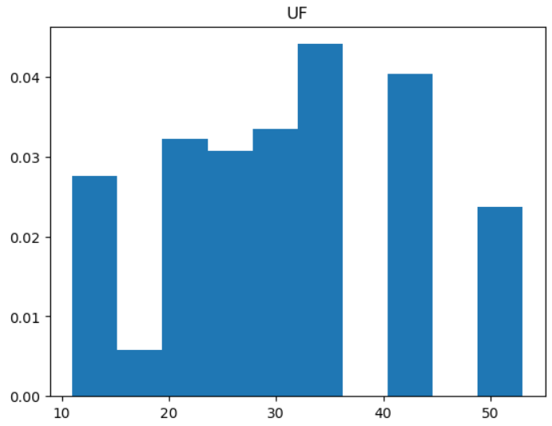

# Cdados-projeto3 
Tema: Como a fatores sociais afetam a Renda Domiciliar 
Bimestre: 2  
Target: Renda  
Features: Educação, Emprego, Sexo, Número de Moradores  
#

# Tema:
Considerando fatores sociais, como nível de escolaridade e ocupação profissional, o objetivo deste projeto é entender como essas variáveis podem ser usadas para prever a renda domiciliar média de uma população. Com base nesses dados, buscamos mapear as principais características socioeconômicas que influenciam diretamente a renda em diferentes regiões brasileiras, identificando se esses fatores variam de acordo com o contexto regional e em que medida cada um impacta a renda domiciliar média.

A compreensão desses fatores que afetam a renda é relevante porque pode contribuir para o desenvolvimento de políticas públicas voltadas à redução das desigualdades regionais.

Percebemos que tal questionamento é válido uma vez que já foi abordado em artigos científicos como em Impacto da educação sobre a pobreza e distribuição de renda no Brasil (2002), Deliberalli Priscila Pereira e O impacto da escolaridade sobre a distribuição de renda, Marcio Antonio Salvato.
#

# Descrição das Variáveis:
1. UF: Essa variável diz respeito a cada estado e, considerando que cada um tem diferentes níveis de desenvolvimento econômico e oportunidades de emprego, essa informação impacta diretamente a renda média de seus habitantes.

2. Capital: A renda de quem vive na capital geralmente é maior devido ao maior acesso a empregos bem remunerados.

3. Rural ou Urbano: As cidades concentram um maior acesso a empregos formais e renda mais alta em comparação aos moradores de áreas rurais.

4. Tipo de área: Áreas metropolitanas e centrais geralmente oferecem melhores oportunidades de trabalho e, consequentemente, renda mais elevada.

5. Pessoas na Casa: O número de pessoas na casa pode indicar necessidade de maior renda, famílias maiores geralmente têm uma renda per capita menor.

6. Sexo: A análise dessa variável ajuda a identificar possíveis desigualdades salariais entre homens e mulheres.

7. Alfabetizado?: Pessoas alfabetizadas têm acesso a empregos melhor remunerados, aumentando potencialmente sua renda.

8. Idade: Idade pode estar associada ao nível de experiência e, portanto, ao potencial de renda, até determinado ponto na carreira.

9. Cor: A variável pode revelar desigualdades raciais no acesso a empregos e salários mais altos.

10. Frequentou escola?: Ter frequentado a escola indica melhor acesso ao mercado de trabalho e maiores chances de empregos bem remunerados.

11. Rendimento bruto mensal em dinheiro: Representa a própria renda mensal do indivíduo, sendo o valor direto a ser previsto.

12. Trabalha ou faz estágio remunerado: A presença no mercado de trabalho ou estágio remunerado tende a aumentar a renda mensal.

13. Nível de instrução mais elevado alcançado (>= 5 anos): Níveis mais altos de instrução correlacionam-se com melhores empregos e, portanto, renda mais alta.

14. Anos de estudo (>= 5 anos): Anos adicionais de estudo geralmente aumentam as qualificações e potencial de renda do indivíduo.
#

# Descrição da Secção de Boxblots sobre as Variáveis Quantitativas 
Na primeira sessão de gráficos, foram expostas as distribuições de 4 variáveis. 

 

O primeiro Boxplot mostra a distribuição do número de pessoas em uma casa, tendo como destaques a mediana (abaixo de 5 pessoas), os quartis, valores máximos e mínimos, bem como os pontos outliers que retratam números de moradores por casa acima do usual. Em resumo, aproximadamente: 

média: 3 
desvio padrão: 1 
mínimo: 1 
25%: 2 
50%: 3 
75%: 4 
máximo: 22 

Os demais apresentam a mesma informações, mas para variáveis distintas, respectivamente: 

-> rendimento bruto mensal em dinheiro, com valores aproximados para: 
média: 1090 
desvio padrão: 2832 
mínimo: 0 
25%: 0 
50%: 0 
75%: 1350 
máximo: 250000 

-> Idade: 
média: 37 
desvio padrão: 22 
mínimo: 0 
25%: 18 
50%: 37 
75%: 55 
máximo: 115 

-> Anos de Estudo: 
média: 8 
desvio padrão: 5 
mínimo: 0 
25%: 4 
50%: 9 
75%: 12 
máximo: 16 

Por certo, como essas variáveis são importantes para o desenvolvimento do projeto, visualizar a sua distribuição em um boxplot precisa ser realizada. 
#

# Histogramas sobre as Variáveis Qualitativas 

A análise do histograma é importante pois nos da uma visão melhor sobre a destribuição desigual de uma variável.

o primeiro histograma mostra a distribuição de uma variável UF no eixo x;

o segundo histograma mostra a distribuição de uma variável capital no eixo x;

o terceiro histograma mostra a distribuição de uma variável urbano ou rural no eixo x;

o quarto histograma mostra a distribuição de uma variável tipo de área pelo eixo x;

o quinto histograma mostra a distribuição de uma variável pessoas por casa pelo eixo x;

o sexto histograma mostra a distribuição de uma variável sexo pelo eixo x;

o sétimo histograma mostra a distribuição de uma variável alfabeto pelo eixo x;

o oitavo histograma mostra a distribuição de uma variável cor pelo eixo x;

o nono histograma mostra a distribuição de uma variável frequentou escola ou não pelo eixo x;

o décimo histograma mostra a distribuição de uma variável atividade remunerada ou não pelo eixo x;

o décimo primeiro histograma mostra a distribuição de uma variável nível de instrução pelo eixo x;

#